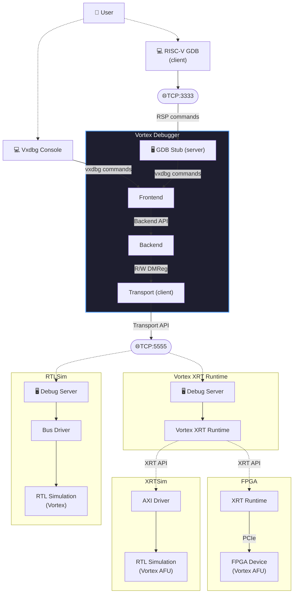

# VxDebug
Debugger For Vortex GPGPU

## Vortex Debug System Overview



## Prerequisites
```bash
# Install readline (optional)
sudo apt install libreadline-dev
```

## Build/Install Instructions
```bash
# Building the debugger
make all

# Quick test to print debugger version
make test
```
- Use `DEBUG=1` to build with debug flags.
- Use `USE_READLINE=0` to build without readline.

```bash
# Install to a specific path (default `$HOME/opt/bin`).
make PREFIX=<install-path> install

# Add path to bashrc
echo "export PATH=\$HOME/opt/bin:\$PATH" >> ~/.bashrc
```

## Usage
We use a config script (`vxdbg.cfg`) to perform initialization, start GDB server, and connect transport.

```bash
vxdbg -f vxdbg.cfg
```

- Verbosity levels: `0:error`, `1:warn`, `2:info`, `3:debug_vxdebug`, `4:debug_backend`, `5:debug_transport`. Set using `-v <level>`

## Debug console usage
A list of all commands that the debugger supports can be displayed using `help` command.
To see command specific help, use `<cmd> --help` or `help <cmd>`. 

Following are some of the commonly used commands. 

> All commands are typed in lowercase, `[c]ommand` means the command has a short alias `c`.

1. **connecting to a vortex instance (sim/FPGA)**: 
    - debugger can be connected to a local/remote vortex instance using `transport --tcp <ip>:<port>`. 
    - To connect to a locally running simulator/FPGA, omit the ip parameter or specify as `localhost`.

2. **resetting the platform**: 
    - `[R]eset` command performs a soft reset using ndmreset signal.
    - `[R]eset --halt` command perform reset and halts all warps. This allows debugging from the first instruction after reset.

3. **Checking warp status**:
    - `[i]nfo warps`: displays warp status.
    - `[i]nfo warps --long`: displays warp status in long format.

4. **halting warps**:
    - `[h]alt`: halts the current warp.
    - `[h]alt --all`: halts all warps.
    - `[h]alt --wid 0 4 5`: halts specified wids.
    - `[h]alt --except <wid>` halts all warps except specified.

5. **Resuming warps**:
    - `[c]ontinue`: continue the current warp.
    - `[c]ontinue --all`: continue all warps.
    - `[c]ontinue --wid 0 4 5`: continue specified wids.
    - `[c]ontinue --except <wid>` continue all warps except specified.

6. **selecting a warp for debugging**
    - `sel <wid> <tid>`: selects specified warp and thread pair for debugging. 
    - some commands can only be performed once a warp/thread is selected.

7. **stepping a warp**
    - `[s]tepi`: steps a warp by 1 assembly instruction.
    - `[s]tepi n`: steps the selected warp by `n` assembly instructions.

8. **reading/writing registers and memory contents**
    - `[r]reg r <name>`: reads a riscv register of selected thread.
    - `[r]reg w <name> <value>`: writes a value to riscv register of selected thread.
    - register names can be specified as arch (`x0-31`) or abi names (`la, sp, t0, s2...`).
    - `[m]em r <addr> <len>`: reads `len` bytes starting at `addr`.
    - `[m]em w <addr> <byte0,byte1,byte2...>`: writes spefified bytes starting at `addr`.


## Debugging using GDB
- The debugger can act as a bridge between vortex instance and RISC-V gdb.
- A gdbserver can be started using command `gdbserver --port <tcp-port>`. This is a blocking operation. 
- Once started, launch GDB in another terminal and use the provided `gdbinit.cfg` to connect to vxdebug and initialize things (use: `riscv64-unknown-elf-gdb -x gdbinit.cfg`)
- Once gdb is connected, it is recommended to load symbols using `file <path-to-elf-file>`. This helps gdb map PC values to lines in the C/C++ code and provide contextual information. 

**Vortex specific GDB commands**
```bash
vx_thread <warpid> <threadid>   # select a warp/thread pair for debugging
vx_warp <Warpid>                # Select a warp for debugging (tid=0)
vx_info                         # Display info about currently selected thread
```


## Helpful scripts
We provide vxdebug and gdb scripts to aid in debugging.
- `vxdbg.cfg`: connects to tcp port, resets platform, and sets-up the environment.
- `vxdbg_gdb.cfg`: does the same followed by starting gdbserver at port 3333.
- `gdbinit.cfg`: sets up gdb for vortex debugging. 


## FAQs:
1. I set a breakpoint in a kernel and continue, my warp 0 never halts on breakpoint while all other warps behave 
    normally halting at the breakpoint. 
    ```c  
    void wspawn_kernel() {
        unsigned wid = vx_warp_id();     // <- break here
        wspawn_buffer[wid] = 65 + wid;
        vx_tmc(0 == wid);
    }

    int test_wsapwn() {
        PRINTF("Wspawn Test\n");
        int num_warps = std::min(vx_num_warps(), 8);
        vx_wspawn(num_warps, wspawn_kernel);
        wspawn_kernel();                // <1>

        return check_error(wspawn_buffer, 0, num_warps);
    }
    ```
    **Ans:** What might have happend is that the compiler might have inlined the kernel call `<1>`.
    Since warp 0 execute the inlined version and other warps are spawned at kernel addres, 
    warp 0 never reaches the kernel function and therefore never halts. Try compiling with `-O0/-O1`
 