# VxDebug
Debugger For Vortex GPGPU

**Vortex Debug System Overview**

```mermaid
flowchart TD 
    user[👤 User]
    p1([🌐TCP:3333])
    gdb["💻 RISC-V GDB<br/>(client)"]
    console[💻 Vxdbg Console]
    subgraph vxdbg[Vortex Debugger]
        Ds["🖥️ GDB Stub (server)"]
        Df[Frontend] 
        Db[Backend]
        Dt["Transport (client)"]
        Ds -- "vxdbg commands" --> Df
        Df -- "Backend API" --> Db
        Db -- "R/W DMReg" --> Dt
    end
    style vxdbg fill:#1e1e2f,stroke:#4e9eff,stroke-width:2px,color:white
    
    p2([🌐TCP:5555])
    user .-> console -- "vxdbg commands" --> Df
    user .-> gdb --> p1 -- "RSP commands" --> Ds
    Dt -- "Transport API" --> p2
    
    %% RTLSIm 
    subgraph rtlsim[RTLSim]
        Rs[🖥️ Debug Server]
        Rb[Bus Driver]
        Rm["RTL Simulation<br/>(Vortex)"]
        Rs --> Rb --> Rm
    end
    
    p2 .-> Rs
    
    %% XrtSim
    subgraph xrtruntime[Vortex XRT Runtime]
        Xrs[🖥️ Debug Server]
        Xrt[Vortex XRT Runtime]
        Xrs --> Xrt
    end
    
    subgraph xrtsim[XRTSim]
        Xsa[AXI Driver]
        Xsm["RTL Simulation<br/>(Vortex AFU)"]
        Xsa --> Xsm 
    end
    
    Xrt .->|XRT API| Xsa 
    
    %% FPGA
    subgraph F[FPGA]
        Fxr[XRT Runtime]
        Fxd["FPGA Device<br/>(Vortex AFU)"]
        Fxr -- "PCIe" --> Fxd
    end
    Xrt .-> |XRT API| Fxr
    
    p2 .-> Xrs
```



# Prerequisites
```bash
# Install readline (optional)
sudo apt install libreadline-dev
```

# Build/Install Instructions
```bash
# Building the debugger
make all

# Quick test to print debugger version
make test
```
- Use `DEBUG=1` to build with debug flags.
- Use `USE_READLINE=0` to build without readline.

```bash
# Install to a specific path (default `$HOME/opt/bin`).
make PREFIX=<install-path> install

# Add path to bashrc
echo "export PATH=\$HOME/opt/bin:\$PATH" >> ~/.bashrc
```

# Usage
We use a config script (`vxdbg.cfg`) to perform initialization, start GDB server, and connect transport.

```bash
vxdbg -f vxdbg.cfg
```

- Verbosity levels: `0:error`, `1:warn`, `2:info`, `3:debug_vxdebug`, `4:debug_backend`, `5:debug_transport`. Set using `-v <level>`
